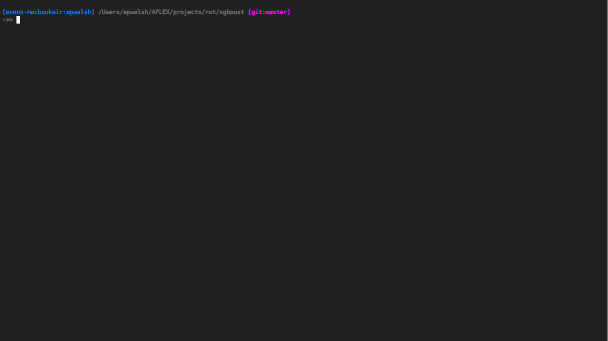

# Dotfiles

### iTerm2 + neovim + tmux



### Transition from Vim to Neovim

To get started with neovim on OS X:
- Install neovim using homebrew.
- Run ```pip install neovim```, ```pip3 install neovim```, ```pip install jedi```, ```pip install flake8```
- Copy necessary files to ```~/.config/nvim/``` and then clone Vundle.
- Install Vundle with ```git clone https://github.com/VundleVim/Vundle.vim.git ~/.config/nvim/bundle/Vundle.vim```
- Start neovim and ```:PluginInstall``` and then run ```:UpdateRemotePlugins```.

### Requirements and add-ons

Linux and OS X
- vcprompt
- R >= 3.1.2
- Python >= 2.7, 3.4
- Vim >= 7.4
- Neovim >= 0.1.2
- Tmux >= 1.9
- gcc
- Make
- iPython
- Tmuxinator
- Git >= 2.3
- Virtualenv, virtualenvwrapper
- tree

OS X only
- iTerm2
- Homebrew
- XCode command line tools
- TeX (MacTeX probably)
