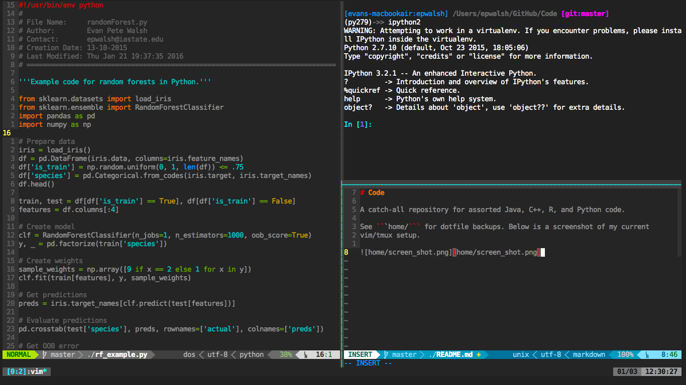

# Dotfiles

iTerm2 + vim/neovim + tmux



### Transition from Vim to Neovim

To get started with neovim on OS X:
- Install neovim using homebrew.
- Run ```pip install neovim``` and ```pip3 install neovim```.
- Copy necessary files to ```~/.config/nvim/``` and then clone Vundle.
- Start neovim and ```:PluginInstall``` and then run ```:UpdateRemotePlugins```.
